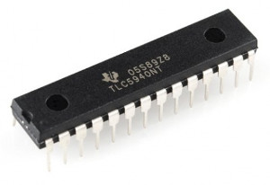
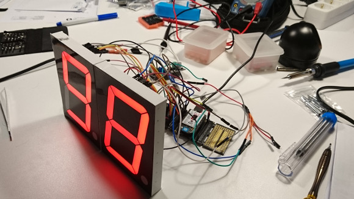

# TLC5940 Micropython Library



Minimal implementation of grey scale data transmission with multiple tlc5940 in series.

```python
import tlc5940
tlc = tlc5940.interface('GP23', 'GP1', 'GP7', 'GP2', 'GP14', 'GP16')
data = tlc5940.simple_byte_array("1010000000000000")
tlc.set_data(data) # enable output0 and output2
```

Includes example code for driving multiple 7-segments displays.



Only tested with the WiPy microcontroller.

Sources:

[TI Programming Flow Chart](http://www.ti.com/lit/sw/slvc106/slvc106.pdf)

[TI TLC5940 Data Sheet](http://www.ti.com/lit/ds/symlink/tlc5940.pdf)

Matthew T. Pandina's ["Demystifying the TLC5940"](https://sites.google.com/site/artcfox/demystifying-the-tlc5940) written for the AVR-GCC compiler.
